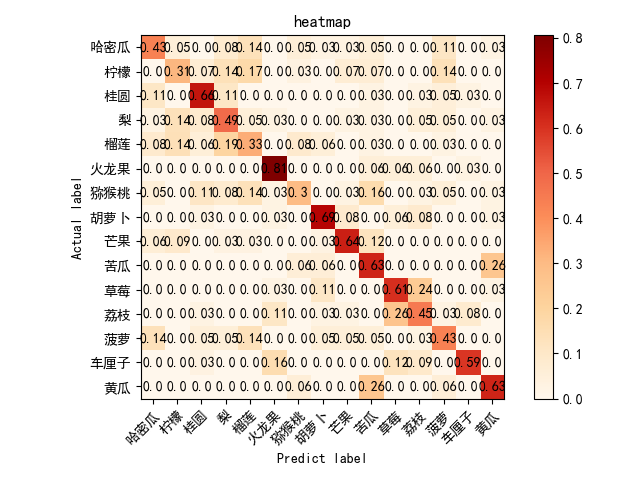

# FruitRecognition
DeepLearning深度学习大作业，利用CNN和MobileNetV2搭建的水果识别模型。

---
#### `Lab文件夹中有七个深度学习课程相关实验以及文档。`

#### fruit为本次大作业使用的数据集。
#### FruitRecognition为本次大作业相关代码及相关曲线热力图。
#### `PhotoForReadme为md文件的图片备份。`

---
[一、概述](#1) <br>
    [1、项目背景](#11) <br>
    [2、项目意义](#12) <br>
    [3、问题定义](#13) <br>

[二、构建模型](#2) <br>
    [1、数据样本](#21)<br>
    [2、模型结构](#22)<br>
        &emsp;[2.1 CNN结构](#221)<br>
        &emsp;[2.2 MobileNetV2结构](#222)<br>

[三、实验结果](#3)<br>
    [1、CNN训练过程及分析](#31)<br>
    [2、MobileNetV2训练过程及分析](#32)<br>

[四、总结](#4) <br>

<a id="1"></a>
## 一、	概述  
<a id="11"></a>
### 1.	项目背景

&emsp;水果是人们日常生活中重要的食品之一，其营养丰富、口感美味、色香俱佳，因此备受广大消费者的喜爱。
然而，在市场上，各种不同品种的水果琳琅满目，对于人类的肉眼识别来说并不容易实现。传统的检测方法需要人工参与，效率低下，成本高昂，
同时还容易出现误判和漏检等问题。基于此，利用计算机视觉技术开发水果识别系统，能够极大地提升水果检测的效率，
减少人工介入，为消费者提供更好的服务体验。
<a id="12"></a>
### 2.	研究意义
&emsp;随着智能手机、平板电脑等移动设备的广泛应用，人们越来越需要将物理世界和数字世界相结合。在这个环境下，开发一款高效、精准的水果识别系统，有助于优化用户体验，提高生产效率，降低生鲜水果流通损失率，从而推动整个水果行业的数字化转型。
<a id="13"></a>
### 3.	问题定义
&emsp;本项目旨在研究利用深度学习模型进行水果图像分类的方法，具体包括两个主要任务：一是使用卷积神经网络（CNN）模型进行水果图片的分类，二是探索轻量级神经网络模型MobileNetV2在水果图像分类中的应用。
<a id="2"></a>
## 二、	构建模型
<a id="21"></a>
### 1、	数据样本
使用百度飞桨-公共数据集

https://aistudio.baidu.com/aistudio/datasetdetail/193821


&emsp;因为30种水果种类过多，不便于后续的热力图生成与结果分析，所以只取其中的15类水果数据，并按照4：1对数据集进行划分为训练集和测试集。
有以下15类：哈密瓜、柠檬、桂圆、梨、榴莲、火龙果、猕猴桃、胡萝卜、芒果、苦瓜、草莓、荔枝、菠萝、车厘子、黄瓜。
数据集中的图片的尺寸大小并不统一，所以在进行模型训练以及验证之前，定义了加载数据集的函数。 

```python
def data_load(data_dir, test_data_dir, img_height, img_width, batch_size)
```

&emsp;通过传入的img_height, img_width参数，调用TensorFlow函数

```python
def train_ds = tf.keras.preprocessing.image_dataset_from_directory(
        data_dir,
        label_mode='categorical',
        seed=123,
        image_size=(img_height, img_width),
        batch_size=batch_size) 
```

&emsp;将数据集图片全部处理成img_height * img_width的大小即224*224.
<a id="22"></a>
### 2、	模型结构
&emsp;一是使用卷积神经网络（CNN）模型进行水果图片的分类，二是探索轻量级神经网络模型MobileNetV2在水果图像分类中的应用。
<a id="221"></a>
#### 2.1 CNN结构
通过TensorFlow构建CNN模型


模型定义函数如下：

```python
def model_load(IMG_SHAPE=(223, 224, 3), class_num=15):
    # 搭建模型
    model = tf.keras.models.Sequential([
        # 对模型做归一化的处理
        tf.keras.layers.experimental.preprocessing.Rescaling(1. / 255, input_shape=IMG_SHAPE),
        # 卷积层
        tf.keras.layers.Conv2D(32, (3, 3), activation='relu'),
        # 池化层
        tf.keras.layers.MaxPooling2D(2, 2),
        # 卷积层
        tf.keras.layers.Conv2D(64, (3, 3), activation='relu'),
        # 池化层
        tf.keras.layers.MaxPooling2D(2, 2),
        # 二维输出转化一维
        tf.keras.layers.Flatten(),
        tf.keras.layers.Dense(128, activation='relu'),
        tf.keras.layers.Dense(class_num, activation='softmax')
    ])
    # 输出模型信息
    model.summary()
    opt = tf.keras.optimizers.SGD(learning_rate=0.005)
    model.compile(optimizer=opt, loss='categorical_crossentropy', metrics=['accuracy'])
    return model

```

##### 模型介绍：


&emsp;首先将输入的图片进行归一化处理到0~1之间。然后就是两层卷积层，第一层将通道数由3进行升维到32，第二层则由32升维到64，两层卷积层的卷积核大小都是3*3，默认步长为1。每层卷积之后都使用Max最大池化，大小2*2，使用默认步长为2.然后通过Flatten将输出展开到一维长度，随后是一个全连接层，输出到128个神经元。激活函数全部使用的是ReLU。最后一层全连接层，输出映射到15个神经元，因为数据集中是15种水果，采用softMax激活函数，用来预测每个类别的概率。
<a id="222"></a>
#### 2.2 MobileNetV2结构

&emsp;MobileNet的基本单元是深度可分离卷积，实质是一种可分解卷积操作。可分为两个更小的操作：Depthwise convolution和Pointwise convoluton。
标准的卷积核Dk*Dk*M是对与输入通道数M进行卷积操作,N个卷积核。


&emsp;而MobileNet的Depthwise是对每个输入通道进行分别的卷积 。因为这属于分组卷积，所以在进行卷积操作以后为了减少信息损失，然后再用pointwise convolution也就是1*1的卷积核进行卷积。


&emsp;通过Depthwise convolution和Pointwise convoluton深度可分离卷积以后的整体效果和一个标准卷积差不多，但因为是对不同的通道进行分别卷积，相较于常规的对整体所有通道进行卷积，可以显著的减少计算量，通过pointwise convolution又不损失信息不减少精度，速度更快。


&emsp;而MobileNetV2相较于V1的改进，是使用了反向线性残差结构。


&emsp;先采用了1 * 1卷积进行了升维，然后采用3 * 3深度可分离卷积进行特征提取，最后用1 * 1卷积进行降维，降维时不采用激活函数。V2比V1的参数量和计算量会更小、准确率会更高。
模型定义函数如下：

```python
def model_load(IMG_SHAPE=(224, 224, 3), class_num=15):
	#加载预训练的mobilenet模型
    base_model = tf.keras.applications.MobileNetV2(input_shape=IMG_SHAPE,
                                                   include_top=False,
                                                   weights='imagenet')
    base_model.trainable = False
    model = tf.keras.models.Sequential([
        # 进行归一化的处理
        tf.keras.layers.experimental.preprocessing.Rescaling(1. / 127.5, offset=-1, input_shape=IMG_SHAPE),
        # 主干模型
        base_model,
        #全局平均池化
        tf.keras.layers.GlobalAveragePooling2D(),
        # 全连接层
        tf.keras.layers.Dense(class_num, activation='softmax')
    ])
    model.summary()
    model.compile(optimizer='adam', loss='categorical_crossentropy', metrics=['accuracy'])
    return model
```

##### 模型介绍：
&emsp;迁移学习调用了在ImageNet上预训练后的MobileNetV2模型，并去除了顶部的全连接层只留下里面的卷积层和池化层，作为我们的主干模型。冻结了主干模型的参数以适应我们后面自己添加的全连接层的训练，可以加快训练速度。


&emsp;整个模型先进行归一化，映射到-1~1之间，然后通过我们的主干模型，接着是全局平均池化转化为固定长度的向量。然后就是一个全连接层，映射到class_num个神经元上，也就是我们的水果种类的数量15，通过softmax激活函数预测每个水果类别的概率。
<a id="3"></a>
### 三、	实验结果
<a id="31"></a>
#### 1、	CNN训练过程及分析

&emsp;除了定义数据集加载函数data_load和模型构建函数model_load外，还定义了showAccuracyAndLoss(history)用来从history中提取模型训练集和验证集的准确率和误差损失，绘制训练过程中的loss和accuracy曲线图。

```python
def data_load(data_dir, test_data_dir, img_height, img_width, batch_size)
def model_load(IMG_SHAPE=(224, 224, 3), class_num=15)
def show_loss_acc(history)
```

&emsp;在train(epochs)函数中调用history = model.fit(train_ds, validation_data=val_ds, epochs=epochs)进行训练，通过model.save("models/cnn_fv.h5")保存为模型文件。

&emsp;定义了test_cnn()函数通过保存的模型文件对验证集进行验证，并通过showHM绘制heatmap热力图。
&emsp;先使用sgd随机梯度下降优化器和categorical_crossentropy
多分类交叉熵损失函数，epcoh=10进行训练，默认学习率0.01。


&emsp;在第10轮时训练集的准确率只有74%，明显训练轮次过少，调整epoch=25重新训练。


&emsp;观察曲线，在18轮以后，训练集的准确率就已经达到了100%，而测试集上的准确率只有50%，随着轮次的增加，测试集上的交叉熵损失值也在增加，发生过拟合。



&emsp;测试集的热力图表现出来的准确率也比较差。
&emsp;调整学习率，由0.01降为0.05，其它不变，重新训练。


&emsp;效果不佳。继续降低学习率为0.001，epoch增加到40，重新训练。


&emsp;相较于最初的0.01学习率，测试集上的交叉熵损失在2一下，更低了一点，但是测试集上的准确率还是没有得到很大的提高。 


&emsp;改变优化器，使用Adam优化器，epoch=40，其它保持不变，学习率默认0.01


&emsp;在第10轮时对于训练集的准确率就已经100%，而测试集的交叉熵损失反而达到4以上，比使用sgd优化器时的过拟合更加严重。


&emsp;尝试调整CNN网络结构。


&emsp;首尾增加2个卷积层池化层，Flatten展开一维后增加1个全连接层，训练70轮，使用sgd优化器和多分类交叉熵损失函数，效果不理想。


&emsp;排查原因，首要原因是数据集的问题，对于像荔枝的数据集，在我们这个模型中预测出来的草莓的概率反而比荔枝更高。查看数据集图片发现这个数据集样本量不够大，荔枝只有156张图片，而且有剥开皮的、还没熟透绿色的、照片调色过艳的，类型过杂图片过少造成预测准确率低。


&emsp;利用tensorFlow的ImageDataGenerator对训练集进行数据增强，加上原来的数据集部分，扩大为原来的5倍。
```python
datagen = ImageDataGenerator(
    rotation_range=40,  # 随机旋转角度范围
    width_shift_range=0.2,  # 随机水平平移范围(相对于图片宽度)
    height_shift_range=0.2,  # 随机竖直平移范围(相对于图片高度)
    shear_range=0.2,  # 随机裁剪
    zoom_range=0.2,  # 随机缩放
    horizontal_flip=True,  # 随机水平翻转
    vertical_flip=True,  # 随机竖直翻转
    fill_mode='nearest')  # 填充模式
```
&emsp;使用最早定义的CNN网络，epoch=15，sgd优化器和多分类交叉熵损失函数，训练结果如下：


&emsp;使用原始的测试集测试后的热力图：


&emsp;对数据增强后的测试集进行测试，测试结果热力图：


<a id="32"></a>
#### 2、	MobileNetV2训练过程及分析
&emsp;使用adam优化器和sgd随机梯度下降优化器和categorical_cr ossentropy多分类交叉熵损失函数，默认学习率0.01，epoch=10进行训练。


&emsp;可以观察到在第6轮训练时，训练集上的准确率就已经达到了100%，而且测试集上的准确率也有90%以上，交叉熵损失达到0.5以下。训练效果非常好。
&emsp;对原始测试集测试热力图如下：


&emsp;对数据增强后的测试集，测试热力图如下：


&emsp;相比原测试集，准确率只有几类水果稍微下降。


&emsp;由此得知，相比较于从头开始训练一个自己的CNN模型，利用迁移学习使用预训练过的MobileNetV2作为主干，利用它在ImageNet上学到的特征，在此基础上进行微调适应自己的数据集，可以显著降低训练时间和成本，大大提高准确度。
<a id="4"></a>
###  四、总结

&emsp;在本项目中着重探索了利用深度学习模型进行水果图像分类的方法。具体而言包括使用卷积神经网络（CNN）模型进行水果图片的分类和探索轻量级神经网络模型MobileNetV2在水果图像分类中的应用。

&emsp;在第一项任务中，使用TensorFlow构建了一个简单的CNN模型，并通过调整模型参数来提高准确率。在实验过程中发现由于数据集的问题，训练结果并不理想，测试集上的准确率低于预期，同时出现了过拟合的情况。针对这个问题，从优化器、学习率和训练轮次等方面入手，对模型进行了改进和调整。但是由于数据集本身的局限性，改进效果并不显著。后续对数据集进行数据增强，效果相对右改善。因此使用迁移学习中的MobileNetV2模型进行图像分类。

&emsp;在第二项任务中，使用预训练的MobileNetV2模型作为主干模型，并对其进行微调以适应自己的数据集。通过这种方法成功地提高了分类准确率。 迁移学习对于解决小规模数据集上的图像分类问题具有重要意义。